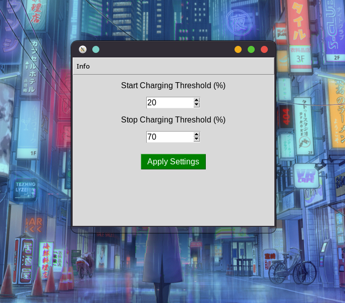

# Batter - TLP Battery Threshold Manager

**Batter** is a simple GUI application designed to manage TLP battery charging thresholds on Linux systems. It allows users to adjust battery start and stop charging percentages to prolong battery health and optimize performance.

## Purpose

The main purpose of Batter is to:
- Enable users to easily configure battery charging thresholds without manually editing configuration files.
- Improve battery lifespan by avoiding overcharging and maintaining charge within healthy ranges.

## Features

- **User-Friendly Interface**: A straightforward graphical interface built with `tkinter`.
- **Custom Charging Thresholds**: Set start and stop charging percentages for the battery.
- **Immediate Application**: Automatically updates the TLP configuration file and restarts the TLP service to apply changes.
- **Error Handling**: Provides clear error messages for invalid inputs, permission issues, or unexpected problems.
- **About Section**: Displays developer information for support.




## Prerequisites

- Python 3.6 or higher
- **TLP**: Installed and configured on the system
- `acpi` and `upower`: You'll need these for battery status
- `tkinter`: Usually comes pre-installed with Python
- **Root Privileges**: Required to modify TLP settings
- **TESTED ON FEDORA 41 ONLY**

## Installation

1. Clone this repository:
   ```bash
   git clone https://github.com/905timur/batter-app.git
   cd batter-app
